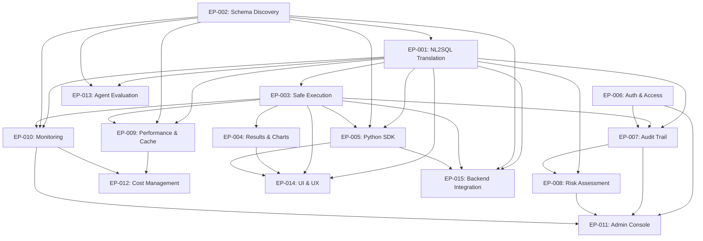

# Project Epics

## Overview
This document outlines the major epics for the NL2SQL project, organized by themes and aligned with the objectives defined in the [BRD Overview](brd-overview.md). Each epic represents a significant deliverable that contributes to the overall project goals.

## Requirements Traceability Summary

**Coverage Analysis:**
- **15 Epics** mapped to **5 Objectives**
- **15 FRDs** covering functional and technical requirements
- **5 PRDs** covering user experience and product design
- **100% objective coverage** across all epics
- **Phase 1-3 implementation** ensures systematic delivery

**Priority Mapping:**
- **Phase 1 (MVP)**: OBJ-001, OBJ-005 primary focus (core functionality + user experience)
- **Phase 2 (Security)**: OBJ-002, OBJ-004 primary focus  
- **Phase 3 (Scale)**: OBJ-003 primary focus (performance and operational scale)

This traceability ensures that every epic contributes directly to project success and that all requirements are captured and planned for implementation.

---

## Epic Structure
- **Theme**: Logical grouping of related epics
- **Epic ID**: Unique identifier (EP-XXX)
- **Business Value**: Impact and rationale
- **Dependencies**: Cross-epic relationships
- **Acceptance Criteria**: High-level success measures
- **Estimated Complexity**: T-shirt sizing (XS, S, M, L, XL)

---

## Theme 1: Core NL2SQL Engine

### EP-001: Natural Language to SQL Translation (FRD-003)
**Objective Alignment**: OBJ-001, OBJ-002  
**Business Value**: Enable users to express database queries in natural language with high accuracy and safety  
**FRD Mapping**: FRD-003

**Key Capabilities**:
- **Multi-Agent Architecture**: Orchestrator, NL2SQL specialist, and validation agents
- **Prompt Optimization with DSPy**: Systematic prompt engineering and optimization pipeline
- **Example SQL Queries**: Curated query templates and few-shot learning examples
- **Query Validation & Safety**: Syntax checking, semantic validation, and risk assessment
- **Complex Query Support**: Joins, aggregations, subqueries, window functions
- **Database Dialect Support**: PostgreSQL and DuckDB-specific SQL generation

**Dependencies**: EP-002 (Schema Discovery)  
**Estimated Complexity**: XL  

**Acceptance Criteria**:
- Convert 90%+ of well-formed natural language questions to valid SQL
- Multi-agent coordination with <500ms orchestration overhead
- DSPy-optimized prompts achieve 15%+ accuracy improvement over baseline
- Support complex queries (joins across 3+ tables, aggregations, subqueries)
- Maintain <2% schema reference error rate
- Generate explainable SQL with clear mapping to NL intent

---

### EP-002: SQL Connection & Schema Discovery (FRD-002)
**Objective Alignment**: OBJ-001, OBJ-002  
**Business Value**: Provide robust database connectivity and comprehensive schema understanding for grounded SQL generation  
**FRD Mapping**: FRD-002

**Key Capabilities**:
- **Basic SQL Connection**: Secure connection management for PostgreSQL and DuckDB
- **Schema Introspection**: Discover tables, columns, relationships, constraints, indexes, and data types
- **RAG Setup for Large Schemas**: Implement vector-based schema retrieval for databases with 100+ tables
- **Schema Refresh & Drift Detection**: Handle schema evolution and versioning
- **Connection Pooling**: Support multiple concurrent database connections
- **Schema Metadata Caching**: Performance optimization with intelligent cache invalidation

**Dependencies**: None (foundational)  
**Estimated Complexity**: L  

**Acceptance Criteria**:
- Successfully introspect 100% of supported database objects
- Handle schemas with 1000+ tables using RAG-based retrieval
- Detect schema changes within 5 minutes of refresh
- Support connection pooling for 50+ concurrent connections
- Maintain schema cache with configurable TTL and smart invalidation

---

### EP-003: Safe Query Execution Engine
**Objective Alignment**: OBJ-002, OBJ-004  
**Business Value**: Ensure secure, read-only database access with comprehensive safety guardrails  
**FRD Mapping**: FRD-004

**Key Capabilities**:
- Enforce read-only execution (block DML/DDL)
- Implement query timeouts and resource limits
- Handle result set pagination for large datasets
- Provide query preview and confirmation workflows
- Support query cancellation and cleanup

**Dependencies**: EP-001 (SQL Generation), EP-002 (Schema Discovery)  
**Estimated Complexity**: L  

**Acceptance Criteria**:
- Block 100% of write operations (DML/DDL)
- Enforce configurable query timeouts (default: 30s)
- Handle result sets up to 10M rows with pagination
- Provide query execution status and progress tracking

---

## Theme 2: User Experience & Reporting

### EP-004: Results Presentation & Chart Generation (FRD-005)
**Objective Alignment**: OBJ-001  
**Business Value**: Deliver insights through intelligent visualizations and multi-format exports  
**FRD Mapping**: FRD-005

**Key Capabilities**:
- **Intelligent Chart Generation**: Multi-agent system for automatic chart type selection and rendering
- **Natural Language Summaries**: Context-aware result interpretation and insights
- **Multi-Format Export**: CSV, JSON, Markdown with consistent formatting
- **Large Dataset Handling**: Pagination and sampling for 1M+ row datasets
- **Visualization Types**: Bar, line, scatter, pie charts with automatic data pattern detection
- **Result Metadata**: Query context, execution stats, and data lineage

**Dependencies**: EP-003 (Query Execution)  
**Estimated Complexity**: M  

**Acceptance Criteria**:
- Generate appropriate charts for 80%+ of result patterns automatically
- Multi-agent chart generation with <200ms processing time
- Generate concise, accurate NL summaries for 95%+ of result sets
- Support 5+ chart types with automatic type selection
- Export results in 3+ formats with consistent formatting
- Handle exports for datasets up to 1M rows with intelligent sampling

---

### EP-005: Python SDK & Developer Experience
**Objective Alignment**: OBJ-005  
**Business Value**: Enable easy integration into existing Python applications and workflows  
**FRD Mapping**: FRD-007

**Key Capabilities**:
- Provide clean, intuitive Python API
- Support async/await patterns for better performance
- Include comprehensive documentation and examples
- Handle connection management and error handling
- Support configuration and customization options

**Dependencies**: EP-001, EP-002, EP-003  
**Estimated Complexity**: M  

**Acceptance Criteria**:
- Deliver production-ready Python package with semantic versioning
- Provide 3+ complete integration examples
- Achieve 90%+ API documentation coverage
- Support both sync and async execution patterns

---

## Theme 3: Governance & Security

### EP-006: Authentication & Authorization
**Objective Alignment**: OBJ-002, OBJ-004  
**Business Value**: Ensure secure access control aligned with organizational policies and database permissions  
**FRD Mapping**: FRD-001

**Key Capabilities**:
- Integrate with existing authentication systems
- Respect database-level permissions and roles
- Implement user session management
- Support role-based query restrictions
- Provide access audit trails

**Dependencies**: None (can be developed independently)  
**Estimated Complexity**: L  

**Acceptance Criteria**:
- Support integration with 2+ authentication providers
- Maintain user session state across requests
- Enforce database permissions without escalation
- Log all authentication and authorization events

---

### EP-007: Audit Trail & Compliance
**Objective Alignment**: OBJ-004  
**Business Value**: Provide comprehensive logging and audit capabilities for regulatory compliance and governance  
**FRD Mapping**: FRD-006

**Key Capabilities**:
- Log all user queries, generated SQL, and execution results
- Track query approval workflows and decisions
- Implement data retention and purging policies
- Support audit report generation
- Integrate with external SIEM/logging systems

**Dependencies**: EP-001, EP-003, EP-006  
**Estimated Complexity**: M  

**Acceptance Criteria**:
- Capture 100% of query execution events with full context
- Support configurable data retention policies
- Generate compliance reports on demand
- Integrate with at least 1 external logging system

---

### EP-008: Risk Assessment & Query Approval
**Objective Alignment**: OBJ-002, OBJ-004  
**Business Value**: Implement intelligent risk assessment to flag potentially problematic queries for review  
**FRD Mapping**: FRD-006

**Key Capabilities**:
- Analyze queries for potential performance or security risks
- Implement configurable approval workflows
- Support manual review and approval processes
- Provide risk scoring and explanation
- Enable administrator override capabilities

**Dependencies**: EP-001 (SQL Generation), EP-007 (Audit Trail)  
**Estimated Complexity**: L  

**Acceptance Criteria**:
- Flag queries with 90%+ accuracy for defined risk criteria
- Support multi-level approval workflows
- Provide clear risk explanations to reviewers
- Complete approval processes within configurable SLAs

---

## Theme 4: Performance & Observability

### EP-009: Performance Optimization & Query Caching (FRD-009)
**Objective Alignment**: OBJ-003  
**Business Value**: Ensure fast response times through intelligent caching and optimization strategies  
**FRD Mapping**: FRD-009

**Key Capabilities**:
- **Query-to-SQL Cache**: Intelligent caching of NL→SQL translations with semantic similarity matching
- **Result Set Caching**: Cache frequently requested query results with smart invalidation
- **LLM Prompt Optimization**: Token usage reduction and response time improvement
- **Connection Pooling**: Database connection management and resource optimization
- **Query Templating**: Pattern recognition for common query structures
- **Performance Monitoring**: Real-time latency tracking and optimization recommendations

**Dependencies**: EP-001, EP-002, EP-003  
**Estimated Complexity**: M  

**Acceptance Criteria**:
- Achieve ≤6s P50 and ≤12s P95 latency for typical queries
- Query-to-SQL cache hit rate ≥60% for similar questions
- Reduce LLM token usage by 30%+ through caching and optimization
- Support concurrent query execution for 10+ users
- Smart cache invalidation with 95%+ accuracy for schema changes
- Provide configurable cache policies and TTL settings

---

### EP-010: Monitoring & Observability
**Objective Alignment**: OBJ-003, OBJ-004  
**Business Value**: Provide comprehensive visibility into system performance, usage patterns, and issues  
**FRD Mapping**: FRD-008

**Key Capabilities**:
- Implement distributed tracing for query lifecycle
- Track performance metrics and SLA compliance
- Monitor LLM usage and costs
- Provide alerting for system issues
- Support integration with monitoring platforms

**Dependencies**: All core epics (EP-001 through EP-003)  
**Estimated Complexity**: M  

**Acceptance Criteria**:
- Provide end-to-end tracing for 100% of queries
- Track and alert on key performance metrics
- Integrate with 2+ monitoring platforms (e.g., Prometheus, DataDog)
- Support custom metric definition and collection

---

### EP-013: Agent Evaluation & Quality Assurance (FRD-014)
**Objective Alignment**: OBJ-002, OBJ-003  
**Business Value**: Ensure consistent agent accuracy and performance through systematic evaluation and testing  
**FRD Mapping**: FRD-014 (new)

**Key Capabilities**:
- **Evaluation Framework**: Comprehensive test suites for NL2SQL accuracy assessment
- **Benchmark Datasets**: Curated evaluation sets across different query complexities
- **Agent Performance Metrics**: Accuracy, latency, and safety scoring systems
- **Continuous Testing**: Automated evaluation pipelines and regression detection
- **A/B Testing Infrastructure**: Compare different prompt strategies and model configurations
- **Error Analysis**: Systematic categorization and root cause analysis of failures

**Dependencies**: EP-001 (NL2SQL Translation), EP-002 (Schema Discovery)  
**Estimated Complexity**: M  

**Acceptance Criteria**:
- Maintain 90%+ accuracy on standardized evaluation benchmarks
- Support evaluation across 5+ query complexity categories
- Automated testing pipeline with daily evaluation runs
- Comprehensive error categorization and trending analysis
- A/B testing framework for prompt and model optimization

---

### EP-014: User Interface & Experience (PRD-001)
**Objective Alignment**: OBJ-001, OBJ-005  
**Business Value**: Provide intuitive, accessible interface for business users and analysts  
**PRD Mapping**: PRD-001 (new)

**Key Capabilities**:
- **Query Interface**: Natural language input with auto-suggestions and examples
- **Results Dashboard**: Interactive tables, charts, and export controls
- **Query History**: Search, favorite, and reuse previous queries
- **Backend Integration**: Seamless API integration with pagination and real-time updates
- **Responsive Design**: Multi-device support for desktop, tablet, and mobile
- **User Onboarding**: Guided tutorials and contextual help system

**Dependencies**: EP-001, EP-003, EP-004, EP-005  
**Estimated Complexity**: L  

**Acceptance Criteria**:
- Responsive UI supporting 3+ screen sizes
- Query input with auto-complete and suggestion features
- Real-time result updates with pagination for large datasets
- User satisfaction score ≥4.0/5.0 in pilot testing
- Complete user onboarding flow with interactive tutorials

---

### EP-015: Backend Integration & API Management (PRD-002)
**Objective Alignment**: OBJ-003, OBJ-005  
**Business Value**: Robust backend services supporting scalable integration and data handling  
**PRD Mapping**: PRD-002 (new)

**Key Capabilities**:
- **RESTful API Design**: Comprehensive API for all NL2SQL operations
- **Pagination Strategy**: Efficient handling of large result sets
- **Rate Limiting**: Request throttling and quota management
- **Backend Scalability**: Horizontal scaling and load balancing
- **API Documentation**: OpenAPI specs and interactive documentation
- **Integration Patterns**: Webhooks, streaming, and batch processing support

**Dependencies**: EP-001, EP-002, EP-003, EP-005  
**Estimated Complexity**: M  

**Acceptance Criteria**:
- RESTful API supporting all core operations
- Pagination handling for datasets up to 10M rows
- API response times ≤200ms for metadata operations
- Comprehensive API documentation with 95%+ coverage
- Support for 100+ concurrent API requests

---

## Theme 5: Administration & Operations

### EP-011: Administration Console
**Objective Alignment**: OBJ-004, OBJ-005  
**Business Value**: Provide administrators with tools to manage, configure, and monitor the NL2SQL system  
**FRD Mapping**: FRD-010

**Key Capabilities**:
- User and permission management interface
- System configuration and settings management
- Query approval and review workflows
- Usage analytics and reporting dashboard
- System health and status monitoring

**Dependencies**: EP-006, EP-007, EP-008, EP-010  
**Estimated Complexity**: L  

**Acceptance Criteria**:
- Provide web-based admin interface for key management tasks
- Support bulk user management operations
- Display real-time system health and usage metrics
- Enable configuration changes without system restart

---

### EP-012: Cost Management & Resource Controls
**Objective Alignment**: OBJ-003  
**Business Value**: Implement controls to manage LLM and compute costs while maintaining service quality  
**FRD Mapping**: FRD-008

**Key Capabilities**:
- Implement usage quotas and rate limiting
- Support multiple LLM provider configurations
- Track and report cost attribution by user/team
- Provide cost optimization recommendations
- Support budget alerts and automated controls

**Dependencies**: EP-009 (Performance), EP-010 (Monitoring)  
**Estimated Complexity**: S  

**Acceptance Criteria**:
- Support configurable usage quotas per user/team
- Track costs with 95%+ accuracy attribution
- Provide cost optimization insights and recommendations
- Implement automated cost controls and budget alerts

---

## Epic Dependencies Map

---

## Implementation Phases

### Phase 1: MVP Foundation (Q4 2025)
**Target**: Deliver core functionality for internal pilot with basic user interface

**Priority Epics**:
- EP-002: SQL Connection & Schema Discovery (L)
- EP-001: Natural Language to SQL Translation (with multi-agent setup) (XL)
- EP-003: Safe Query Execution Engine (L)
- EP-004: Results Presentation & Chart Generation (M)
- EP-005: Python SDK & Developer Experience (M)
- EP-013: Agent Evaluation & Quality Assurance (basic framework) (M)
- EP-014: User Interface & Experience (L)

**Success Criteria**: Meet OBJ-001 (MVP delivery with ≥5 pilot users) and OBJ-005 (user adoption)

### Phase 2: Security & Governance (Q4 2025 - Q1 2026)
**Target**: Production-ready security and compliance

**Priority Epics**:
- EP-006: Authentication & Authorization (L)
- EP-007: Audit Trail & Compliance (M)
- EP-008: Risk Assessment & Query Approval (L)
- EP-010: Monitoring & Observability (basic) (M)
- EP-009: Performance Optimization & Query Caching (query2sql cache) (M)

**Success Criteria**: Meet OBJ-002 and OBJ-004 (safety and governance targets)

### Phase 3: Performance & Scale (Q1 2026)
**Target**: Production performance and operational readiness

**Priority Epics**:
- EP-015: Backend Integration & API Management (M)
- EP-009: Performance Optimization & Query Caching (advanced features) (M)
- EP-010: Monitoring & Observability (advanced) (M)
- EP-011: Administration Console (L)
- EP-012: Cost Management & Resource Controls (S)
- EP-013: Agent Evaluation & Quality Assurance (comprehensive) (M)

**Success Criteria**: Meet OBJ-003 (performance targets) and scale for broader adoption

---

## Epic Ownership & Accountability

| Epic | Primary Owner | Stakeholders | Review Cadence |
|------|---------------|--------------|----------------|
| EP-001 | Tech Lead | Product, Data Science | Weekly |
| EP-002 | Backend Engineer | DBA, Platform | Bi-weekly |
| EP-003 | Security Engineer | Tech Lead, Compliance | Weekly |
| EP-004 | Frontend/UX | Product, Users | Weekly |
| EP-005 | Developer Relations | Tech Lead, Community | Bi-weekly |
| EP-006 | Security Engineer | InfoSec, Compliance | Weekly |
| EP-007 | Compliance Lead | Security, Legal | Bi-weekly |
| EP-008 | Product Manager | Security, Business | Weekly |
| EP-009 | Performance Engineer | SRE, Tech Lead | Weekly |
| EP-010 | SRE | Operations, Tech Lead | Weekly |
| EP-011 | Product Manager | Admin Users, Support | Bi-weekly |
| EP-012 | Finance/Product | Operations, Finance | Monthly |
| EP-013 | QA Lead | Tech Lead, Data Science | Weekly |
| EP-014 | UX Lead | Product, Users | Weekly |
| EP-015 | Backend Lead | API Users, DevOps | Bi-weekly |

---

## Success Metrics by Epic

Each epic includes specific metrics aligned with project objectives:

- **Technical Metrics**: Performance, reliability, security
- **Business Metrics**: Adoption, usage, satisfaction  
- **Operational Metrics**: Cost, efficiency, maintainability

Detailed metrics and acceptance criteria are defined in individual epic specifications and tracked through the project lifecycle.

---

## Reference: Project Objectives, FRDs, and PRDs

### Project Objectives (from BRD)

| ID | Objective | Target Metric | Target Date |
|---|---|---|---|
| **OBJ-001** | Ship MVP: Read-only NL→SQL for PostgreSQL and DuckDB with schema introspection, execution, tabular results, and exports for an internal pilot | Pilot weekly active users ≥5 | 2025-10-31 |
| **OBJ-002** | Safety & Accuracy | DML/DDL prevention ≥95%; schema reference error rate ≤2% | 2025-12-31 |
| **OBJ-003** | Performance | NL→result latency ≤6s (P50) and ≤12s (P95) on typical ad-hoc queries (≤10M rows) | 2025-12-31 |
| **OBJ-004** | Governance & Audit | 100% of executed queries logged; approvals enforced for flagged/risky queries | 2025-11-30 |
| **OBJ-005** | Developer Adoption | SDK + docs with 3 reference examples; ≥3 internal integrations | 2025-11-15; 2025-12-31 |

### Feature Requirements Documents (FRDs)

| ID | Title | Brief Outcome | Epic Mapping | Status |
|---|---|---|---|---|
| **FRD-001** | Authentication & Access Control | Enforce read-only, roles, approvals | EP-006 | Planned |
| **FRD-002** | Schema Discovery & Connectors (PG/DuckDB) | Introspect schema; refresh; connectors | EP-002 | Planned |
| **FRD-003** | NL→SQL Planning & Generation | Plan and generate grounded SQL | EP-001 | Planned |
| **FRD-004** | Query Execution & Results | Execute safely; return tables | EP-003 | Planned |
| **FRD-005** | Reporting (Summaries, Charts, Exports) | NL summary, basic charts, CSV/JSON/MD | EP-004 | Planned |
| **FRD-006** | Audit, Logging & Approvals | Full audit trail and approval workflow | EP-007, EP-008 | Planned |
| **FRD-007** | Python SDK & Integration Guides | Simple API; 3 reference examples | EP-005 | Planned |
| **FRD-008** | Observability & Cost Controls | Tracing hooks; latency/cost metrics | EP-010, EP-012 | Planned |
| **FRD-009** | Caching & Templates | Reuse prompt/plans; reduce latency/cost | EP-009 | Planned |
| **FRD-010** | Admin Console (Minimal) | Configs, approvals, logs | EP-011 | Planned |
| **FRD-011** | Data Governance & Retention | Policies for logs/exports | EP-007 | Planned |
| **FRD-012** | Security Hardening & Pen-Test | Threat model, pen-test fixes | EP-006, EP-008 | Planned |
| **FRD-013** | Billing & Plans (If externalized) | Usage accounting, quotas | EP-012 | Future |
| **FRD-014** | SLA & SRE Readiness | Targets, runbooks, alerts | EP-010 | Planned |
| **FRD-015** | Agent Evaluation Framework | Accuracy testing, benchmarks, A/B testing | EP-013 | New |

### Product Requirements Documents (PRDs)

| ID | Title | Brief Outcome | Epic Mapping | Status |
|---|---|---|---|---|
| **PRD-001** | User Interface & Experience Design | Intuitive web interface for business users and analysts | EP-014 | New |
| **PRD-002** | Backend Integration & API Management | Scalable backend services with comprehensive API design | EP-015 | New |
| **PRD-003** | Mobile & Responsive Design | Multi-device support and responsive layouts | EP-014 | Future |
| **PRD-004** | User Onboarding & Help System | Guided tutorials and contextual assistance | EP-014 | Future |
| **PRD-005** | Dashboard & Analytics | Usage analytics and system health dashboards | EP-011 | Future |

### Epic to Requirements Mapping Matrix

| Epic | Primary OBJ | Secondary OBJ | FRD Mapping | PRD Mapping |
|---|---|---|---|---|
| EP-001 | OBJ-001, OBJ-002 | - | FRD-003 | - |
| EP-002 | OBJ-001, OBJ-002 | - | FRD-002 | - |
| EP-003 | OBJ-002, OBJ-004 | - | FRD-004 | - |
| EP-004 | OBJ-001 | - | FRD-005 | - |
| EP-005 | OBJ-005 | - | FRD-007 | - |
| EP-006 | OBJ-002, OBJ-004 | - | FRD-001, FRD-012 | - |
| EP-007 | OBJ-004 | - | FRD-006, FRD-011 | - |
| EP-008 | OBJ-002, OBJ-004 | - | FRD-006, FRD-012 | - |
| EP-009 | OBJ-003 | - | FRD-009 | - |
| EP-010 | OBJ-003, OBJ-004 | - | FRD-008, FRD-014 | - |
| EP-011 | OBJ-004, OBJ-005 | - | FRD-010 | PRD-005 |
| EP-012 | OBJ-003 | - | FRD-008, FRD-013 | - |
| EP-013 | OBJ-002, OBJ-003 | - | FRD-015 | - |
| EP-014 | OBJ-001, OBJ-005 | - | - | PRD-001, PRD-003, PRD-004 |
| EP-015 | OBJ-003, OBJ-005 | - | - | PRD-002 |
