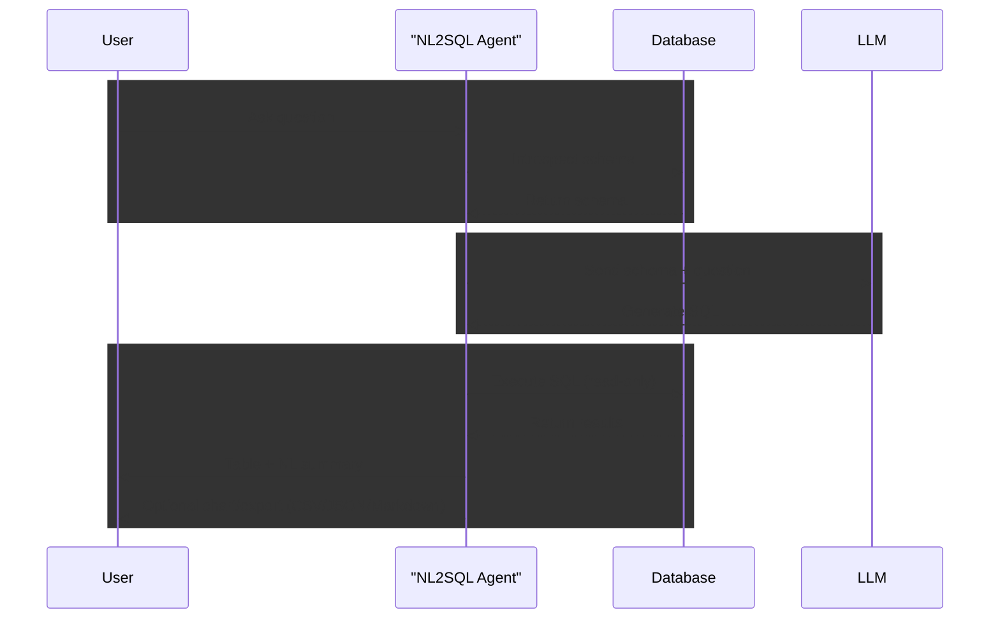

# Product Vision

## Vision Statement
> **NL2SQL** turns natural-language questions into safe, reviewable SQL and delivers tables and lightweight reports over any provided database connection, so both technical and business users can get answers fast without hand-writing queries.

## Target Users / Personas
- **Business Users/Managers** — want answers in plain language with trustworthy tables/reports; benefit from self-serve insights.
- **BI/Data Analysts** — need faster ad‑hoc querying and automation of routine SQL; benefit from acceleration and fewer handoffs.
- **Backend/Platform Engineers** — need an embeddable Python module/agent; benefit from a simple integration surface over existing DBs.
- **Data Engineers/DBAs** — care about governance, performance, and safety; benefit from read‑only defaults, approvals, and observability.

## Problem Statements
### **Time to Insight** 

The translation gap between a business question and correct SQL is slow and error‑prone, especially for non‑SQL users or busy analysts. 

___Risks & challenges:___ 

- ambiguous requests, 
- schema complexity or drift, 
- model hallucinations, 
- permission boundaries, and 
- inconsistent result interpretation.

### **Integration Complexity** 

Embedding NL→SQL capability into products is non‑trivial. 

___Risks & challenges:___

- diverse connectors, 
- latency/cost trade‑offs, 
- safe execution (read‑only, approvals), 
- tracing/observability, and 
- aligning outputs (tables/reports) to downstream workflows.

## Core Features / Capabilities

### Primary

- Natural language to SQL generation with safe‑mode (read‑only by default).
- Schema discovery/introspection to ground generation on actual tables, columns, and relationships.
- Execute and return tabular results and “reports” defined as: 
	1. table + short NL summary, 
	2. simple charts (e.g., bar/line), and 
	3. export formats (CSV/JSON/Markdown).
- Initial database backends: PostgreSQL and DuckDB.
- Simple Python integration: supply a DB connection and invoke the agent to answer questions.

### Secondary
- Guardrails: permission checks, query explainability, and query/result review logs.
- Caching and query templates for recurring questions; minimal prompt/config management.
- Hooks for tracing and cost/latency observability; room for eval sets over time.  
  
## How it works (at a glance)

- Introspect the connected database to build a current schema context for an LLM to consume.
- Plan and generate SQL grounded in the schema.
- Execute in read‑only mode; return a table plus a short, plain‑language explanation; optionally render simple charts and offer CSV/JSON/Markdown exports.

## Business Goals / Success Metrics
- Deferred at this stage

## Scope & Boundaries
### Non-goals

**NL2SQL** is read-only (no DML/DDL) and is not a full BI dashboarding suite or ETL/data modeling tool.

- Charts are simple (bar/line) rather than a full viz designer
- It does not escalate database permissions and respects existing DB auth/roles; 
- PII handling will be relied on upstream DB governance; and 
- SQL generation is designed for safe review/approval rather than guaranteed automation.

## Timeline / Milestones
- Deferred at this stage

## Strategic Differentiators
- Deferred at this stage
